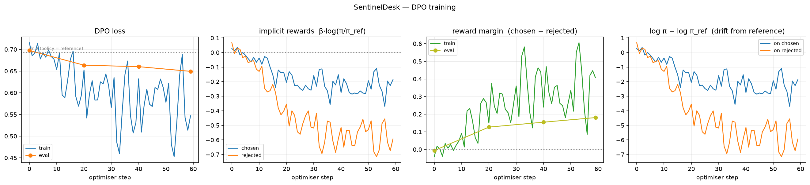

# SentinelDesk — Results

_Generated 2026-09-04 18:37 UTC from the phase reports in this directory. Regenerate with `make report`._

## Headline

On 149 held-out tickets, judged blind in both display orders, the DPO-tuned resolution agent scored 52W / 32L / 65T against the base-prompted agent.

| framing | win-rate | 95% CI | 50% inside? |
|---|---|---|---|
| ties counted as half | 56.7% | 48.7%–64.4% | **yes — not significant** |
| ties dropped | 61.9% | 51.2%–71.5% | **no — significant** |

Exact binomial p on the decisive comparisons = 0.03753.

**The two framings disagree, and neither is quoted alone.** With 65 of 149 comparisons tied (43.6%), how ties are treated decides whether this result clears significance. A fine-tune that mostly produces ties has not improved much, so the conservative reading — ties as half a win, interval containing 50% — is the one to carry.

**Where the advantage comes from: 81.7% of the +0.427 total-score gap is conciseness.** conciseness +0.349, correctness +0.054, completeness +0.031, tone -0.007.

The tuned arm's responses are 31.7% shorter than the baseline's (373.3 vs 546.3 chars), and wins correlate with being shorter at r = -0.2783. See the reward-hacking note in Phase 5 below.

## Phase 0 — DPO loop verified on a toy batch

- loss 0.6931 -> 0.0004, reward margin 0.0 -> 7.8125, accuracy 1.0
- 6 optimiser steps in 9.9s on Qwen/Qwen2.5-0.5B-Instruct
- The starting loss of 0.6931 is ln 2 to four places, which is the independent check that the policy is identical to the reference at init: prompt masking and reference handling are both correct.

## Phase 1 — Preference data

- 594 synthetic tickets, 22 policies covered, median body 50 words
- split: {'heldout': 149, 'train': 445}
- categories: {'billing': 139, 'technical': 135, 'account_access': 106, 'shipping': 107, 'product_info': 107}
- scenario mix: {'multi_part': 109, 'vague': 108, 'wrong_assumption': 211, 'plain': 88, 'urgent_pressure': 78}
- judge: `deepseek-v4-pro:cloud`, rubric `v1` (fingerprint `f14d5cd4800b`)
- 409 comparisons x 2 display orders
- **order-inconsistency rate 15.9%** — how often swapping which response was shown first flipped the verdict. Those comparisons are dropped rather than resolved, and this rate bounds how much any downstream win-rate can be trusted.
- 344 usable pairs (84.1% yield)
- chosen-strategy split: {'rushed': 123, 'grounded': 221}
- mean rubric scores by strategy: {"grounded": {"correctness": 0.489, "completeness": 0.292, "conciseness": 1.127, "tone": 0.961, "total": 2.869}, "rushed": {"correctness": 0.417, "completeness": 0.049, "conciseness": 0.197, "tone": 0.639, "total": 1.302}}
- length ratio chosen/rejected: 0.662 (a ratio far from 1.0 means DPO would learn length before it learns correctness)

**Which rubric dimension actually decided the training labels** (over the 344 usable pairs). If tone or conciseness separated them and correctness did not, DPO would be learning house style and any win-rate would be measuring that instead.

| dimension | mean winner−loser gap | favours winner in |
|---|---|---|
| correctness | +0.738 | 68.9% of pairs |
| completeness | +0.157 | 26.2% of pairs |
| conciseness | +0.605 | 67.7% of pairs |
| tone | +0.449 | 61.3% of pairs |

- correctness was identical on both sides in 31.1% of pairs; both sides scored 0 on correctness in 25.9%
- **second-judge cross-check**: `kimi-k3:cloud` re-labelled 40 of the same comparisons — raw agreement 72.5%, Cohen's kappa 0.5857
- **agreement where both judges committed to a winner: 24/25 = 96.0%**. This is the number that bears on the preference labels. Two labellers can disagree about which response is better, or about whether the gap is decisive enough to call; only the first threatens the data, and a "tie" here means the primary judge flipped across display orders, which already excludes that comparison from training.
- confusion (primary|second): `{'grounded|grounded': 12, 'rushed|grounded': 1, 'tie|tie': 5, 'rushed|rushed': 12, 'tie|grounded': 5, 'grounded|tie': 2, 'tie|rushed': 3}`

## Phase 2 — DPO training

Swept 3 configurations. **Selection used a validation split of the training pairs only — never the held-out tickets the Phase 5 arena scores.** Choosing a checkpoint by its arena win-rate and then reporting that win-rate would make the headline number a measure of how many configurations were tried.

| config | steps | train loss | eval loss | eval acc | eval margin | train−eval margin | drift |
|---|---|---|---|---|---|---|---|
| `learning_rate5e-07_beta0.1` | 60 | 0.7153 → 0.6875 | 0.6971 ⚠ | 0.441 | -0.0066 | +0.020 | +0.129 ⚠eval loss rose |
| `learning_rate2e-06_beta0.1` **(selected)** | 60 | 0.7153 → 0.5468 | 0.6493 | 0.618 | +0.1806 | +0.226 | +2.862 |
| `learning_rate8e-06_beta0.1` | 60 | 0.7153 → 0.1282 | 0.7390 ⚠ | 0.588 | +0.3924 | +1.777 | +17.173 ⚠eval loss rose |

_train−eval margin is the overfitting indicator: a run that separates the training pairs far more confidently than the held-out ones has memorised them, and on a ~34-pair validation split its eval accuracy can still look competitive by luck._

_highest validation preference accuracy, ties broken by margin then loss; configs exceeding the drift limit are ranked last. Selection uses a split of the training pairs only — never the held-out arena tickets._

Validation split: 34 pairs, so the standard error on eval accuracy is about 0.086 (8.6% points). Configurations closer together than roughly twice that are not distinguishable by this measurement.
**The selected configuration beat the runner-up by +0.029 accuracy, which is inside that noise band.** Something has to be chosen, and the rule was fixed in advance, but this selection should be read as 'not clearly worse' rather than 'best'.
- 60 optimiser steps on 310 pairs (34 held out for eval), 1674.2s
- train loss 0.7153 -> 0.5468
- reward margin -0.041 -> +0.407
- implicit reward, chosen +0.027 -> -0.187, rejected +0.067 -> -0.594
- preference accuracy 0.38 -> 0.67
- drift from reference (log pi - log pi_ref on chosen) +0.265 -> -1.870
- eval loss 0.6974 -> 0.6493, eval margin -0.006 -> +0.181

## Phase 3 — Agent graph

- 10 tickets end-to-end through triage -> retrieve -> resolution -> gate
- triage accuracy vs the ticket's true category: **100.0%**
- escalation rate 20.0% (2/10)
- resolver backend: remote

## Phase 4 — Serving

24 requests per arm, max 160 new tokens.

| backend | mode | requests | tokens/s | p50 latency | p95 latency | wall | errors |
|---|---|---|---|---|---|---|---|
| vllm-cpu | sequential | 24 | 17.2 | 9.00s | 10.32s | 205.7s | 0 |
| vllm-cpu | concurrent-8 | 24 | 96.6 | 10.41s | 12.07s | 32.7s | 0 |
| transformers-mps | batched-8 | 24 | 83.2 | 1.18s | 1.18s | 28.4s | 0 |
| mlx-metal | sequential | 8 | 131.7 | 0.42s | 1.56s | 5.0s | 0 |

- _transformers-mps (batched-8): static batching: every request in a batch waits for the slowest to finish, so per-request latency here is an average, not a real per-request measurement_
- _mlx-metal (sequential): mlx_lm has no continuous batching; sequential is the only regime it offers here_

**Continuous batching is worth 5.6x throughput** (17.2 -> 96.6 tokens/s) for 1.16x the median per-request latency. That trade is the reason vLLM exists, and it is invisible in a sequential benchmark — which is why both regimes are measured rather than just the flattering one.

**These backends are not on equal hardware, and the table should not be read as if they were.** vLLM has no Metal backend and ships no macOS wheel, so it runs its CPU build inside a linux/arm64 container; MLX runs on the Metal GPU and transformers on MPS. A GPU path beating a CPU path is the expected outcome, not a verdict on vLLM. What the vLLM rows do establish is the batching behaviour above, which is a property of the engine rather than of the silicon.

## Phase 5 — Blind win-rate, held-out

- tuned arm: `artifacts/dpo/checkpoint`; base arm: `Qwen/Qwen2.5-0.5B-Instruct`
- both arms: identical system prompt, identical retrieved policies, temperature 0.0, max 220 tokens. The only difference is the weights.
- judge `deepseek-v4-pro:cloud`, rubric `v1` — the same rubric as Phase 1, unrevised
- order-inconsistency rate in the arena: 43.6%
- mean response length: {'dpo_tuned': 373.3, 'base_prompted': 546.3} chars, ratio tuned/base 0.683
- **correlation between winning and being shorter than the baseline: -0.2783** — the reward-hacking check.
- **The tuned model reproduced the training data's length skew.** In the preference pairs the chosen side was 0.662x the length of the rejected side; the tuned arm now writes at 0.683x the baseline's length. Those two ratios matching is the clearest single piece of evidence that what DPO learned here was substantially *length*.

| category | n | W | T | L | win rate (adj) |
|---|---|---|---|---|---|
| account_access | 27 | 8 | 13 | 6 | 53.7% |
| billing | 34 | 15 | 12 | 7 | 61.8% |
| product_info | 27 | 11 | 12 | 4 | 63.0% |
| shipping | 27 | 10 | 14 | 3 | 63.0% |
| technical | 34 | 8 | 14 | 12 | 44.1% |

**Why order-inconsistency is high here (43.6%, against 15.9% in Phase 1 labelling).** It is the judge behaving correctly, not failing:

| verdicts | n | mean score gap | mean \|length delta\| |
|---|---|---|---|
| consistent across both orders | 84 | 1.786 | 361 chars |
| flipped when the order swapped | 65 | 0.285 | 133 chars |

The judge flips precisely where the two responses are near-equivalent — a score gap of 0.3 out of 9. Phase 1 compared two deliberately different prompting strategies; the arena compares a model with its own fine-tune. A judge that stayed equally decisive as the arms converged would not be tracking quality. Those flips are recorded as ties rather than resolved, so they widen the interval instead of corrupting the result.

**Degeneracy check**: 2/149 tuned responses are under 60 characters (1/149 for the baseline) and 0 are empty. The tuned model became terser, not broken — which is what makes the brevity finding a real behaviour change rather than a collapse.

| arm | correctness | completeness | conciseness | tone | total |
|---|---|---|---|---|---|
| dpo_tuned | 0.53 | 0.35 | 1.46 | 1.14 | 3.48 |
| base_prompted | 0.47 | 0.32 | 1.11 | 1.15 | 3.05 |
